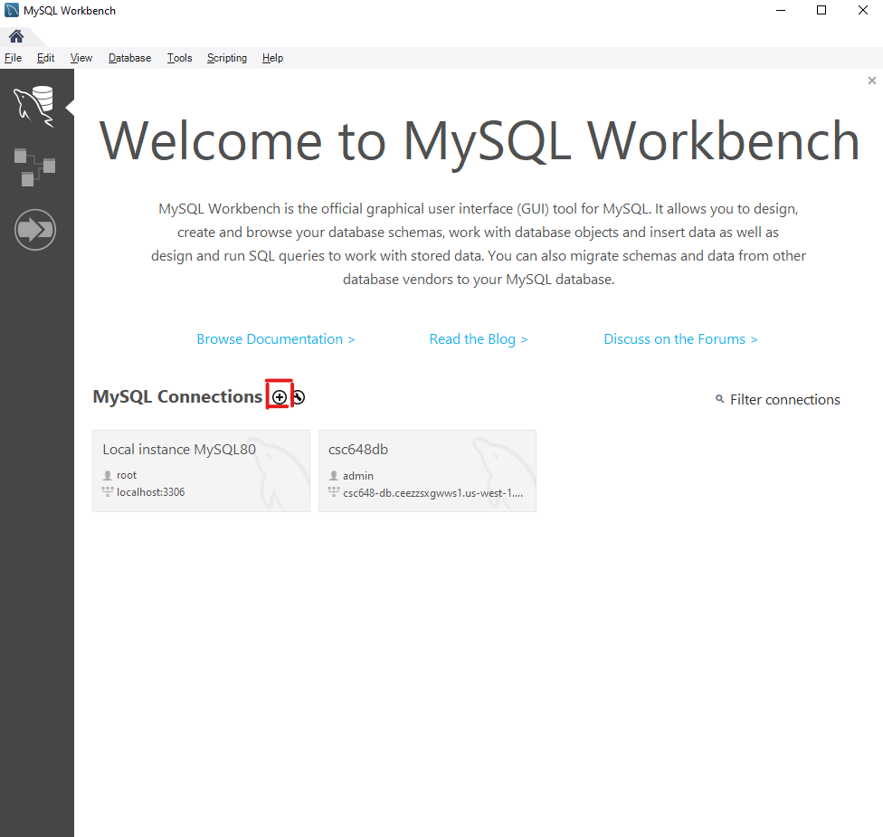
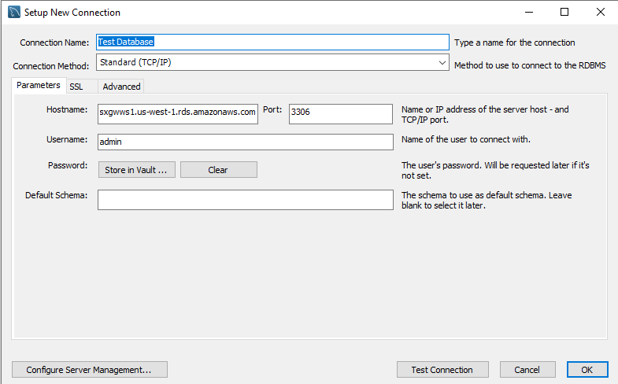

# Connecting to the AWS Database

| Host Name | Username | Password | Port |
| ---- | ---- | ----- | ----- |
| csc648-db.ceezzsxgwws1.us-west-1.rds.amazonaws.com| admin | swampstudy648 | 3306 (default MySql) |

## Connecting using MySQL Workbench
1. Open MySQL Workbench
2. One the main page click the "+" next to "MySQL Connection"

3. In the popup window
    1. Choose a name for the connection and write it into the "Connection Name" field
    2. Copy the Host Name from above and enter into the "Hostname" field
    3. The port should be set to "3306" automatically if it is not do so
    4. Copy the username from above and enter into the "Username" field
    5. Click "OK in the bottom right"
4. Your Popup should look like this

5. Click "OK" in the bottom right
6. Back in the main menu click on the new connection you just created and named

7. A Window will pop up prompting you for the password, enter the one from above

8. Hit Enter and you should be connected to the database and see the Data Base editor.
