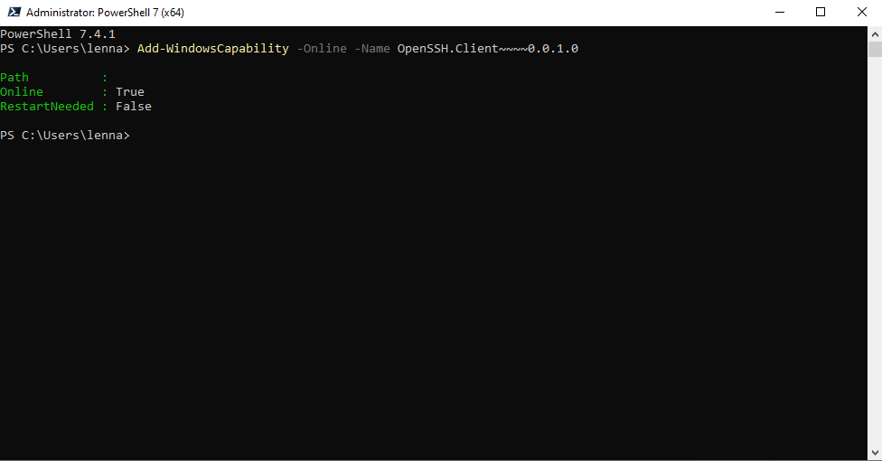
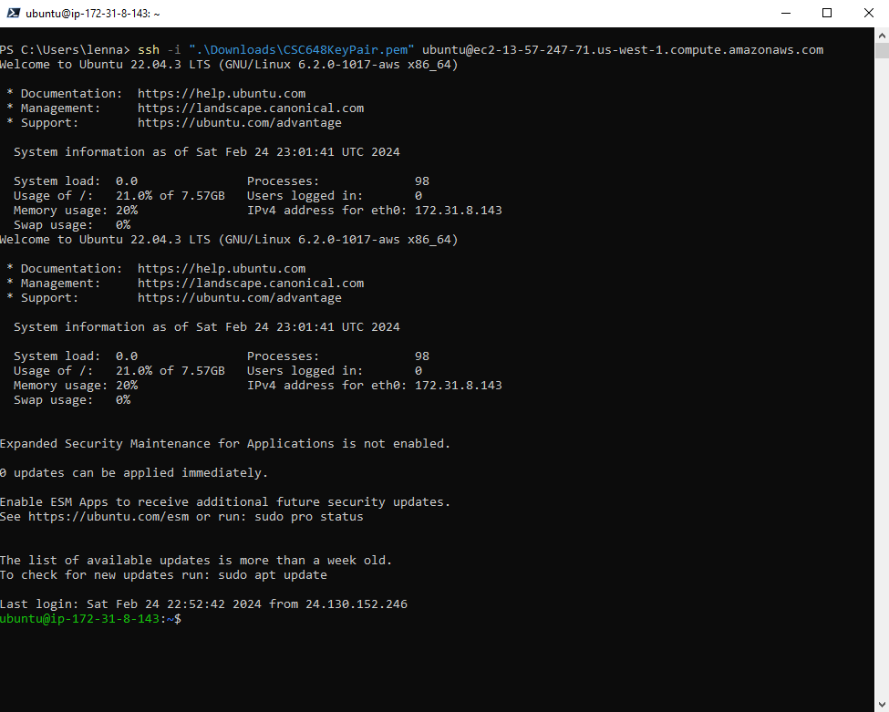

# Connecting to the AWS EC2 Instance (Web Server)

| Host Name | User Name | Private Key |
| --- | --- | --- |
| ec2-54-183-23-211.us-west-1.compute.amazonaws.com | ubuntu | In this folder as "CSC648KeyPair.pem" |

## These Instructions are for Windows Machines
Running Powershell Version 7
1. Open a PowerShell Prompt, right click and run as admin
    1. If you don't have powershell installed do so
2. Run this command `Add-WindowsCapability -Online -Name OpenSSH.Client~~~~0.0.1.0` to install the SSH capability from the powershell

3. Run the command `ssh -i "location of private key file" ubuntu@ec2-13-57-247-71.us-west-1.compute.amazonaws.com`
4. The shell should open up in the Linux terminal. Connection succesful

